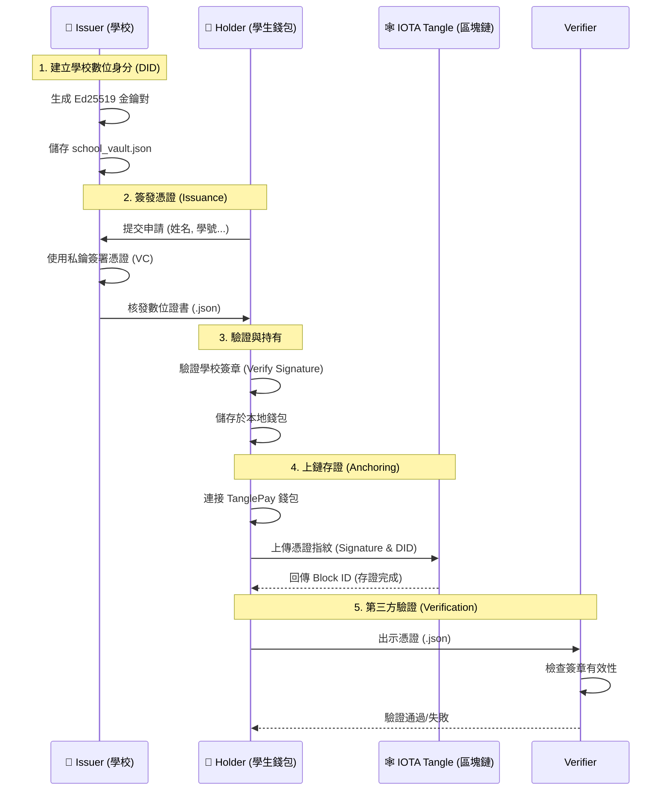

#  去中心化數位學位證書系統 (IOTA SSI Demo)

這是一個基於 **IOTA Tangle** 與 **Verifiable Credentials (VC)** 標準的去中心化身分 (SSI) 演示專案。
本系統模擬了學校發證、學生持有、以及區塊鏈存證的完整流程。

##  系統架構 (System Architecture)

本專案由三個主要角色組成：

1.  **Issuer (學校)**: 負責簽發數位憑證，擁有學校的私鑰。
2.  **Holder (學生)**: 接收並保管憑證，擁有自主權決定是否上鏈存證。
3.  **Verifier (驗證者/區塊鏈)**: 透過 IOTA Tangle 驗證憑證的簽章與存證紀錄。



##  快速開始 (Quick Start)

### 環境需求
*   Node.js (v16+)
*   Chrome 瀏覽器 + **TanglePay** 擴充功能

### 安裝
```bash
npm install
```

###  Demo 流程腳本

#### Step 1: 啟動學校發證伺服器 (Issuer)
學校行政人員操作的介面，用於審核並簽發證書。

1.  開啟終端機，執行：
    ```bash
    node issuer/server.js
    ```
2.  瀏覽器打開：`http://localhost:3000`
3.  **操作**：
    *   填寫學生資料（姓名、學號、GPA）。
    *   選擇憑證類型（如：畢業證書）。
    *   點擊 **「簽發證書」**。
    *   👉 系統會自動下載一個 `.json` 憑證檔案（例如 `Alice_UniversityDegreeCredential.json`）。

#### Step 2: 啟動學生錢包 DApp (Holder)
學生操作的介面，用於管理自己的證書並與區塊鏈互動。

1.  開啟另一個終端機，執行：
    ```bash
    node holder/server.js
    ```
2.  瀏覽器打開：`http://localhost:3001`
3.  **操作**：
    *   **導入憑證**：點擊按鈕，選擇剛剛下載的 `.json` 檔案。
    *   **驗證真偽**：點擊「驗證憑證」，系統會檢查數位簽章是否由學校發出且未被竄改。
    *   **連接錢包**：點擊「連接瀏覽器錢包」（需安裝 TanglePay）。
    *   **上鏈存證**：點擊「上鏈存證」，將憑證指紋寫入 IOTA Tangle。
    *   👉 成功後，點擊 Explorer 連結查看鏈上紀錄。

##  專案結構

*   **`/issuer`**: 發證端程式碼
    *   `create_school.js`: 初始化學校 DID 與金鑰。
    *   `server.js`: 發證 API 伺服器。
    *   `vc_utils.js`: 處理 VC 簽章邏輯。
*   **`/holder`**: 持有端程式碼
    *   `index.html`: 學生錢包前端介面 (DApp)。
    *   `wallet_utils.js`: 處理 TanglePay 連接與上鏈邏輯。
*   **`/data`**: 存放學校私鑰 (模擬 KMS)。

##  安全性設計
*   **隱私保護**: 上鏈資料僅包含 `DID` 與 `Signature`，**不包含**學生姓名或成績等個資 (GDPR Compliant)。
*   **數位簽章**: 使用 Ed25519 演算法確保憑證不可偽造。